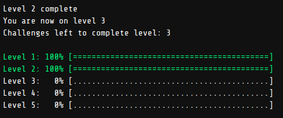

# foo-bar

These are my solutions to the foo-bar challenge invitation
I got from
<span style="color: #0091ea; font-weight:bold; font-size: x-large">G</span>
<span style="color: #f44336; font-weight:bold; font-size: x-large">o</span>
<span style="color: #ffc107; font-weight:bold; font-size: x-large">o</span>
<span style="color: #0091ea; font-weight:bold; font-size: x-large">g</span>
<span style="color: #4caf50; font-weight:bold; font-size: x-large">l</span>
<span style="color: #f44336; font-weight:bold; font-size: x-large">e</span>.

This project is not yet finished, current status is:  


## Repo structure

Until now, all solutions are implemented in **java**.  
Each level consists of 1 to 3 challenges, each of whom
has it's own package under src with the corresponding level as root.

After cloning/forking, to compile and run, change directory into `foo-bar/src`
and type

```bash
foo-bar/src >> javac l1/solution/Verify.java
foo-bar/src >> java l1.solution.Verify
```

Until now, in each challenge, Google provides 2-3 out of the 5-10 total
test cases as examples. The rest of them are hidden.  
For each challenge, source files named **Verify.java**
run the solution provided under the corresponding
**Solution.java** file against those test cases.

## Challenge structure

Based on what I have read until know, this is how the whole challenge
is structured.

| Level | Challenge | Time limit **for each challenge** | Reward after completion             |
|-------|-----------|-----------------------------------|-------------------------------------|
| 1     | 1         | 2 days                            | -                                   |
| 2     | 2         | 3 days                            | Friend referral link<sup>1</sup>    |
| 3     | 3         | 4 days                            | Google Interview<sup>2</sup>        |
| 4     | 2         | 15 days                           | Another friend referral link        |
| 5     | 1         | 25 days                           | **??**                              |

>> 1. A referral link allows the person you send it to, to enter foobar.
>> 2. You are asked to fill out your personal info, if you wish, then
 a Google recruiter will contact you soon.

## Challenges

* Level 1

  1. [Braille Translation](./src/l1/readme.txt)

* Level 2
  1. [Ion Flux Relabeling](./src/l2/c1/readme.txt)
  2. [Gearing Up for Destruction](./src/l2/c2/readme.txt)

* Level 3

  1. [Prepare the Bunnies' Escape](./src/l3/c1/readme.txt)
  2. [The Grandest Staircase Of Them All](./src/l3/c2/readme.txt)
  3. **??**

* Level 4

  1. **??**
  2. **??**

* Level 5

  1. **??**

>> Note that the *readme* files were slightly simplified
while solving the corresponding challenge.

## Contribute

You are welcome to fork this repository and submit your own solutions.
Make a pull request and your version will be reviewed within a few days.

## More information

To learn more about Google's foo.bar challenge,
check out some links below:

1. [medium](https://medium.com/chingu/my-experience-with-the-google-foobar-challenge-and-tips-on-what-to-do-if-you-get-it-9848d31d3d20)
2. [freeCodeCamp](https://www.freecodecamp.org/news/the-foobar-challenge-googles-hidden-test-for-developers-ed8027c1184/)
3. [YouTube](https://www.youtube.com/watch?v=FHQAj9iYPg0)
